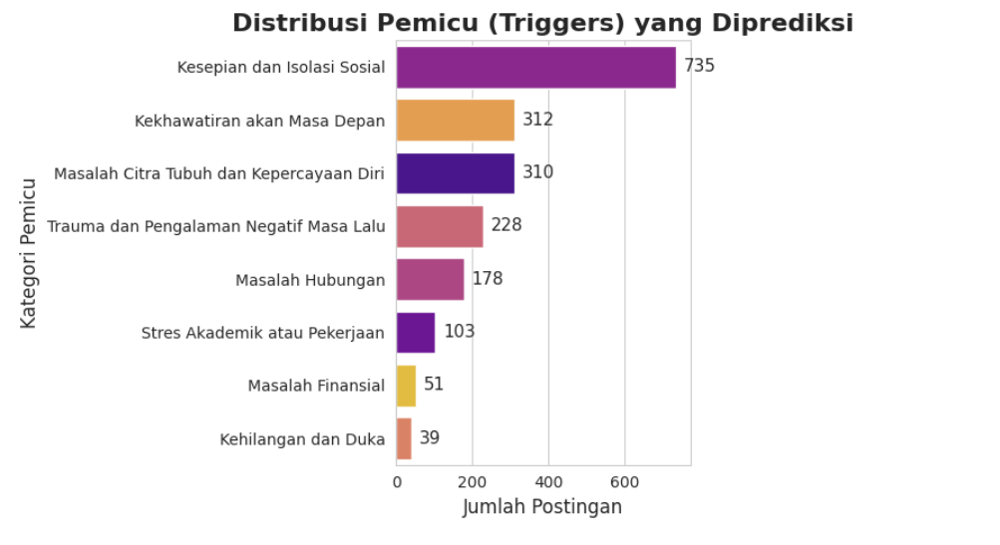
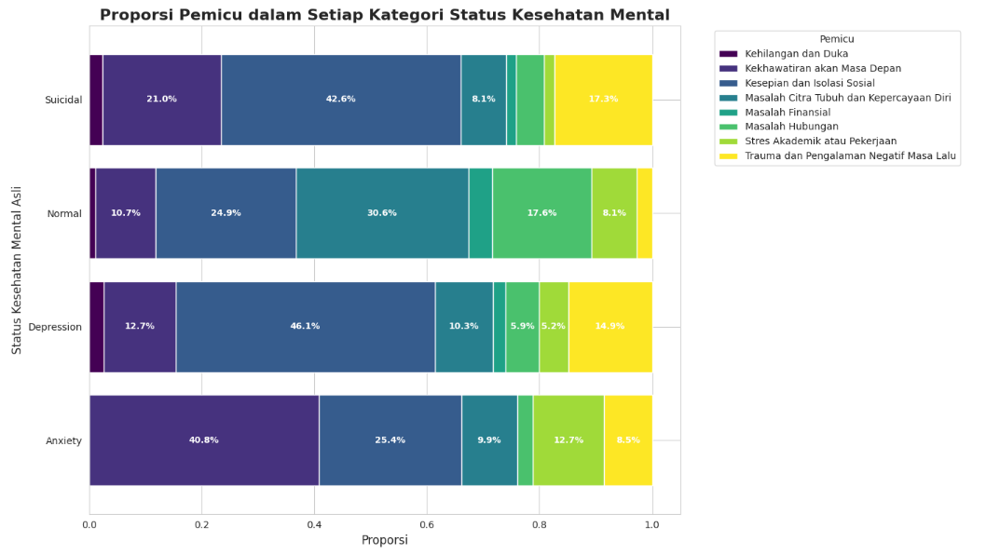

# Dari Label ke Pemicu: Analisis Granular Kesehatan Mental Menggunakan IBM Granite untuk Strategi Intervensi Tertarget


Proyek ini merupakan submission untuk **Capstone Project Hacktiv8 x IBM (Student Developer Initiative)**, yang bertujuan untuk menganalisis data teks tentang kesehatan mental guna menghasilkan insight yang dapat ditindaklanjuti.

---

## 📖 Ringkasan Proyek (Project Overview)

### Latar Belakang

Kesehatan mental adalah isu global yang krusial. Banyak platform online menjadi tempat bagi individu untuk berbagi pengalaman mereka. Namun, data yang dihasilkan seringkali hanya dilabeli secara umum (misalnya, "Depresi", "Kecemasan"). Label umum ini, meskipun berguna, seringkali gagal menangkap **akar masalah** atau **pemicu spesifik** yang dialami individu.

### Pernyataan Masalah

Untuk merancang program dukungan atau intervensi yang benar-benar efektif, organisasi kesehatan mental tidak cukup hanya mengetahui _bahwa_ seseorang mengalami depresi; mereka perlu tahu **mengapa**. Apakah karena tekanan akademik, masalah finansial, kesepian, atau faktor lainnya? Kesenjangan antara label umum dan pemicu spesifik inilah yang ingin dijawab oleh proyek ini.

### Tujuan Proyek

Tujuan utama proyek ini adalah menggunakan kemampuan _Natural Language Processing_ (NLP) dari **IBM Granite** untuk:

1.  **Mengidentifikasi dan mengklasifikasikan pemicu (trigger) spesifik** dari pernyataan-pernyataan terkait kesehatan mental.
2.  **Menganalisis distribusi pemicu** tersebut untuk menemukan pola yang signifikan.
3.  **Menghasilkan rekomendasi yang konkret dan dapat ditindaklanjuti** untuk organisasi kesehatan mental berdasarkan temuan yang ada.

---

## 💾 Dataset

Proyek ini menggunakan dataset **"Sentiment Analysis for Mental Health"** yang tersedia secara publik di Kaggle.

- **Sumber:** [Kaggle Dataset Link](https://www.kaggle.com/datasets/suchintikasarkar/sentiment-analysis-for-mental-health)
- **Fitur Utama yang Digunakan:**
  - `statement`: Data teks mentah yang berisi pernyataan atau postingan pengguna.
  - `status`: Label asli yang diberikan pada setiap pernyataan.

---

## ⚙️ Proses Analisis

Alur kerja analisis proyek ini dirancang secara sistematis untuk mengubah data mentah menjadi insight yang berdampak:

1.  **Eksplorasi Data Awal (EDA):** Memahami distribusi label asli (`status`) dan karakteristik data teks.
2.  **Definisi Kategori Pemicu:** Menentukan serangkaian kategori pemicu yang relevan (misalnya, 'Stres Akademik', 'Masalah Finansial', 'Kesepian', dll.) untuk analisis yang lebih dalam.
3.  **Klasifikasi Pemicu dengan IBM Granite:** Menggunakan model `ibm-granite/granite-3.3-8b-instruct` melalui API untuk melakukan **klasifikasi zero-shot** pada setiap `Statement`, mengelompokkannya ke dalam kategori pemicu yang telah ditentukan.
4.  **Analisis Hasil Klasifikasi:** Menganalisis dan memvisualisasikan distribusi pemicu yang baru dihasilkan untuk mengidentifikasi frekuensi dan pola yang paling umum.
5.  **Ringkasan Tematik dengan IBM Granite:** Menggunakan kemampuan _summarization_ dari IBM Granite untuk merangkum esensi dari pernyataan-pernyataan dalam kategori pemicu teratas, mengubah data kualitatif menjadi temuan yang ringkas.

---

## 💡 Temuan & Insight Utama

### 1. Distribusi Pemicu Kesehatan Mental

Analisis terhadap 2000 pernyataan menghasilkan distribusi pemicu sebagai berikut. Ini menunjukkan pemicu mana yang paling sering dibicarakan secara keseluruhan.

<p align="center">
    
</p>

- **Insight 1:** Pemicu yang paling dominan adalah **Kesepian dan Isolasi Sosial**, mencakup 735 pernyataan (36.75%) dari total pernyataan yang dianalisis.
- **Insight 2:** Pemicu seperti **Kesepian dan Isolasi Sosial** dan **Kekhawatiran akan masa depan** juga menunjukkan frekuensi yang signifikan, menyoroti area masalah utama lainnya.
- **Insight 3:** Pemicu seperti ""Masalah Finansial** dan **Stress Akademik atau pekerjaan\*\* memiliki frekuensi yang lebih rendah dibandingkan dengan pemicu yang bersifat personal dan emosional. Ini mengindikasikan bahwa dalam konteks ini, pergumulan batin lebih sering menjadi fokus utama daripada tekanan dari luar.
- **Rekomendasi awal**: Dominasi isu kesepian dan kecemasan masa depan menyiratkan bahwa program intervensi yang paling berdampak adalah yang berfokus pada **pembangunan komunitas**, **keterampilan sosial**, dan **strategi mengelola ketidakpastian (coping mechanisms)**

### 2. Peta Pemicu di Balik Label Umum

Ketika dibedah lebih lanjut, setiap label `status` asli ternyata memiliki "sidik jari" pemicu yang berbeda.

<p align="center">
    
</p>

- **Insight 1: Sidik Jari Depresi vs. Kecemasan**

  - **Kecemasan (Anxiety)** secara signifikan dipicu oleh **`Kekhawatiran akan Masa Depan`**. Ini adalah kondisi yang berorientasi ke depan.
  - **Depresi (Depression)**, sebaliknya, didominasi oleh **`Kesepian dan Isolasi Sosial`** dan **`Trauma Masa Lalu`**. Ini adalah kondisi yang berakar pada masa kini (rasa terasing) dan masa lalu.

- **Insight 2: Profil Krisis "Suicidal"**

  - Kondisi `Suicidal` menunjukkan kombinasi ekstrem dari proporsi **`Kesepian dan Isolasi Sosial`** yang tertinggi, ditambah dengan porsi **`Trauma`** yang sangat signifikan. Ini menandakan krisis multifaset yang didorong oleh rasa sakit masa lalu dan keterasingan total di masa sekarang.

- **Insight 3: Stres Sehari-hari pada Label "Normal"**
  - Pernyataan `Normal` pun mengandung stres, namun pemicunya lebih mengarah pada stres sehari-hari seperti **`Stres Akademik atau Pekerjaan`** dan **`Masalah Citra Tubuh`**.

---

## 🤖 Penjelasan Dukungan AI (AI Support Explanation)

Kecerdasan Buatan, khususnya model bahasa besar (LLM) **IBM Granite**, memainkan peran sentral dan transformatif dalam proyek ini, bukan hanya sebagai alat bantu.

### 1. Klasifikasi Pemicu secara Zero-Shot

Ini adalah inti dari pendekatan teknis kami. Kemampuan **Klasifikasi Zero-Shot** memungkinkan IBM Granite untuk memahami konteks dan mengklasifikasikan setiap pernyataan ke dalam kategori pemicu yang telah ditentukan, **tanpa perlu proses _fine-tuning_ atau data latih spesifik**.

**Prompt yang Digunakan:**

> Anda adalah seorang analis ahli kesehatan mental. Tugas Anda adalah mengidentifikasi pemicu utama (main trigger) dari pernyataan berikut. Pilih HANYA SATU kategori yang paling relevan dari daftar di bawah ini.
>
> **Pernyataan:** `{statement}`
>
> **Daftar Kategori:** "Masalah Hubungan", "Stres Akademik atau Pekerjaan", "Masalah Finansial", "Kesepian dan Isolasi Sosial", "Masalah Citra Tubuh dan Kepercayaan Diri", "Trauma dan Pengalaman Negatif Masa Lalu", "Kekhawatiran akan Masa Depan", "Kehilangan dan Duka"
>
> Jawaban Anda harus HANYA berupa nama kategorinya.

### 2. Ringkasan Kualitatif secara Abstraktif

Setelah pemicu diidentifikasi, kami memanfaatkan kemampuan **Summarization Abstraktif** untuk "menceritakan" temuan kami. Model tidak hanya mengekstrak kalimat kunci, tetapi mampu mensintesis dan menyusun sebuah ringkasan naratif yang baru dan koheren dari puluhan pernyataan.

**Prompt yang Digunakan:**

> Anda adalah seorang peneliti psikologi yang sedang menganalisis data kualitatif. Berikut adalah sekumpulan pernyataan dari orang-orang yang mengalami `{category_name}`.
>
> Baca semua pernyataan ini dan berikan rangkuman dalam 3-4 poin utama. Rangkuman harus mencakup tema umum, emosi yang sering muncul, dan masalah spesifik yang disebutkan.

---

## ✅ Kesimpulan & Rekomendasi

### Kesimpulan

Proyek ini berhasil menunjukkan bahwa dengan memanfaatkan LLM canggih seperti IBM Granite, kita dapat melampaui analisis sentimen tradisional. Dengan mengubah label umum menjadi pemicu spesifik, kita membuka wawasan yang jauh lebih mendalam tentang perjuangan kesehatan mental yang sebenarnya. Temuan utama menunjukkan bahwa pemicu seperti **Kesepian dan Isolasi Sosial, Kekhawatiran akan masa depan, dan masalah citra tubuh dan kepercayaan diri** adalah masalah yang paling mendesak.

### Rekomendasi (Untuk Organisasi Kesehatan Mental)

Berdasarkan insight yang ditemukan, berikut adalah beberapa rekomendasi yang dapat ditindaklanjuti:

1.  **Fokuskan Program Dukungan pada Pemicu Utama:** Daripada kampanye umum "Atasi Depresi", kembangkan modul workshop atau grup dukungan yang spesifik menargetkan **Kesepian dan Isolasi**. Contoh: "Membangun Koneksi yang Bermakna".
2.  **Sesuaikan Materi Konten Edukasi:** Buat konten (artikel, infografis, video) yang membahas cara mengatasi **Kekhawatiran akan masa depan**. Karena data menunjukkan ini adalah masalah nyata, konten ini akan lebih relevan dan menarik bagi audiens.
3.  **Latih Konselor atau Relawan:** Bekali para konselor dengan data ini untuk membantu mereka memahami bahwa seorang klien yang datang dengan "anxiety" mungkin sebenarnya sedang berjuang dengan **Kekhawatiran akan masa depan**. Ini memungkinkan pendekatan konseling yang lebih empatik dan to-the-point.

---

## 🚀 Cara Menjalankan Proyek

Untuk mereproduksi hasil analisis ini, ikuti langkah-langkah berikut:

1.  **Clone Repositori:**
    ```bash
    git clone https://github.com/tndry/hacktiv8-X-IBM
    cd [NAMA FOLDER REPOSITORI ANDA]
    ```
2.  **Install Dependensi:**
    ```bash
    pip install pandas matplotlib seaborn
    ```
3.  **Siapkan API Key:**
    Pastikan Anda memiliki API Key dari [Replicate.com](https://replicate.com) dan menyimpannya sebagai _secret_ di Google Colab atau di dalam file `.env`.
4.  **Jalankan Notebook:**
    Buka file `analisis_granular_mental_health.ipynb` di Google Colab dan jalankan semua sel secara berurutan.
